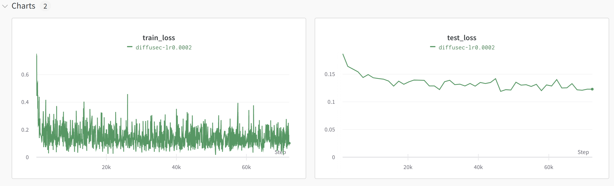
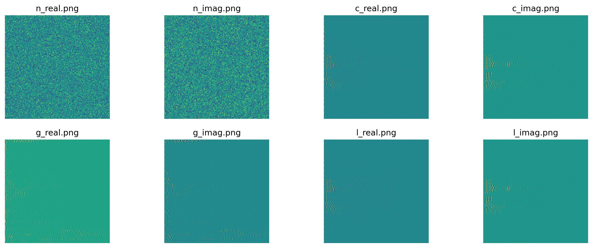
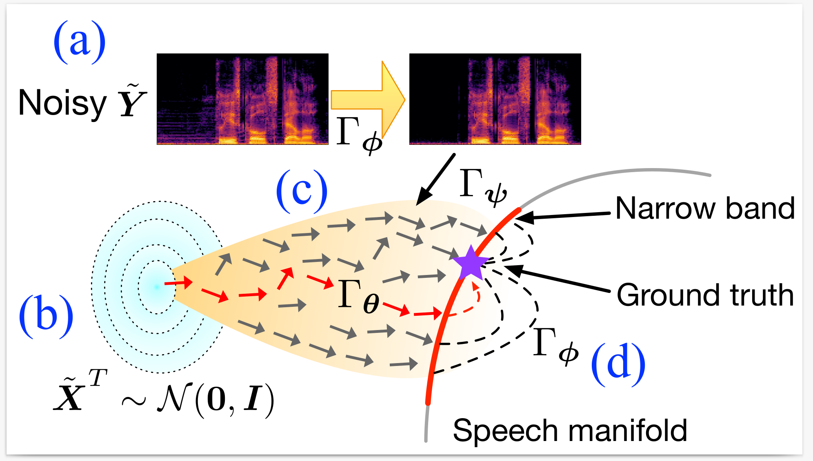
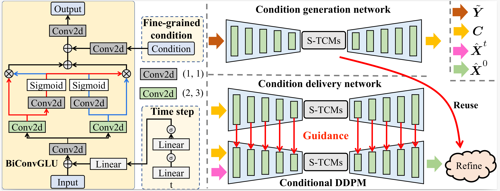

# DR-DiffuSE

---
## Brief
This is the implementation of **DR-DiffuSE** (Revisiting Denoising Diffusion Probabilistic Models for Speech Enhancement: Condition Collapse, Efficiency and Refinement) by **PyTorch**. 

[Paper]() 

In this work, we elicit generative-based speech enhancement methods (e.g., DDPM-based --) by discussing the problem of poor generalization of existing approaches. Despite the significant performance improvements in other domains like audio speech synthesis and image-to-image translation, the performance of DDPM-based speech enhancement methods is generally lower than that of other generative speech enhancement models. We investigate the following drawbacks: (i) condition collapse problem; (ii) trade-offs between effectiveness and efficiency. 

We give a deep-insight analysis of why condition collapse happens in speech enhancement and propose 3 condition-injecting strategies to ameliorate it. We further design a refinement network to (i) calibrate the output of accelerated DDPM, and (ii) train a more robust/generalizable condition generator -- which is important in Conditional DDPMs.

---

## Status
**★★★ Still working in progress ★★★**
Since the NSFC application is concentrated in March, these days are relatively busy...

### Environment Requirements
We run the code on a computer with 2 * RTX-3090, i7 13700KF, and 128G memory. Install the dependencies via anaconda:

```
# create virtual environment
conda create --name dr-diffuse python=3.8.13

# activate environment
conda activate dr-diffuse

# install pytorch & cudatoolkit
conda install pytorch torchvision torchaudio pytorch-cuda=11.7 -c pytorch -c nvidia

# install speech metrics repo:
# Note: be careful with the code version, chiefly pesq and stoi
pip install https://github.com/ludlows/python-pesq/archive/master.zip
pip install pystoi
pip install librosa

# install utils (we use ``wandb`` for logging and ``rich`` for progress display)
pip install wandb
pip install rich
```

### Basic Architecture

We use a UNet-type model from our previous work [Foster Strengths and Circumvent Weaknesses: a Speech Enhancement Framework with Two-branch Collaborative Learning](https://arxiv.org/pdf/2110.05713.pdf) as the basic architecture for speech enhancement. We give the implementation of our basic model in ``src/model/Base.py``, which will be used as the condition generator and also, the refinement network.

### Condition Collapse Problem

To show the condition collapse phenomenon in speech enhancment, we design a model in ``src/model/DiffuSEC.py``, similar to the condition-ddpm method in **Image Super-Resolution via Iterative Refinement(SR3)** and **Palette-Image-to-Image-Diffusion-Models**. 

We train the model via running:
```
python src/train_ddpm.py --model DiffuSEC --lr 0.0002 --wandb
```
After training, we run:
```
python src/test_ddpm.py --model DiffuSEC
```
Note that we save the checkpoint per epoch and automatically select the best model for evaluation, you can manually modify the path of the pre-trained model (see ``src/test_ddpm.py`` and ``src/ddpm_trainer.py``).



We show the difference between the initial gaussian, condition (noisy), generated, and ground truth:



where ``n`` denotes noise, ``c`` denotes condition, ``g`` denotes generated, and ``l`` denotes label (the compressed spec, see ``src/ddpm_trainer.py`` for more details). We can see that correlations between the generated spectrogram and the condition one is weak.


### Our solution -- DR-DiffuSE (work in progress)

**Workflow of DR-DiffuSE:**


**3 condition injecting strategies**:
- Auxiliary conditional generation network
- Dual-path parallel network architecture
- Non-parameterized condition guidance

**fast sampling + refine**:
- Reduce the step from ~1000 to several steps
- Design a refinement network to (i) calibrate, and (ii) improve generalization

**Architecture of DR-DiffuSE:**


**--Work in progress...**

### Acknowledgments
We would like to thank the authors of previous related projects for generously sharing their code and insights:
- [Denoising Diffusion Probabilistic Models](https://github.com/hojonathanho/diffusion)
- [DiffWave: A Versatile Diffusion Model for Audio Synthesis](https://github.com/lmnt-com/diffwave)
- [Foster Strengths and Circumvent Weaknesses: a Speech Enhancement Framework with Two-branch Collaborative Learning](https://github.com/judiebig/Foster-Strengths-and-Circumvent-Weaknesses)
- [Conditional Diffusion Probabilistic Model for Speech Enhancement](https://github.com/neillu23/CDiffuSE)
- [A Study on Speech Enhancement Based on Diffusion Probabilistic Model](https://github.com/neillu23/DiffuSE)

**Special thanks to Yen-Ju Lu for his kind help!**

### References
If you find the code useful for your research, please consider citing

```
@inproceedings{tai2023revisting,
  title={Revisiting Denoising Diffusion Probabilistic Models for Speech Enhancement: Condition Collapse, Efficiency and Refinement},
  author={Wenxin Tai and Fan Zhou and Goce Trajcevski and Ting Zhong},
  booktitle = {AAAI},
  year={2023}
}
```

### Extensions
Note that there are some recent papers that also address the condition collapse problem, we list them here for the convenience of readers.

- [Blended Diffusion for Text-driven Editing of Natural Images](https://arxiv.org/abs/2111.14818)
- [Discrete Contrastive Diffusion for Cross-Modal Music and Image Generation](https://arxiv.org/abs/2206.07771)
- [Adding Conditional Control to Text-to-Image Diffusion Models](https://arxiv.org/abs/2302.05543)
- [T2I-Adapter: Learning Adapters to Dig out More Controllable Ability for Text-to-Image Diffusion Models](https://arxiv.org/abs/2302.08453)


We are currently working on this topic. If you have any questions about this code or are interested in the condition collapse problem, feel free to contact us: ``wxtai AT outlook.com``


